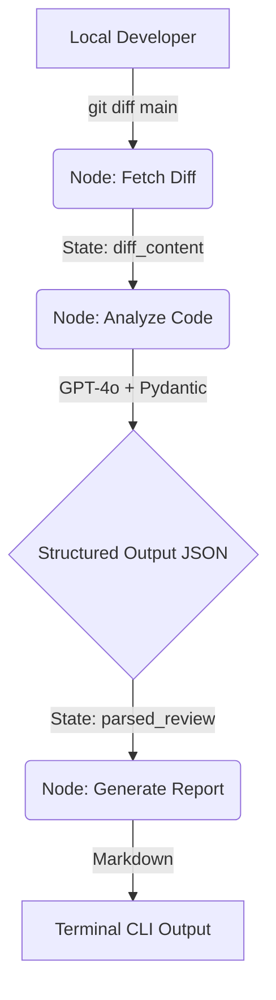

# 🧠 The Reasoning Engine: AI Agents & ETL Pipelines

This module demonstrates advanced, enterprise-grade AI engineering. Rather than basic "text-in, text-out" LLM wrappers, these tools showcase **Agentic State Machines (DAGs)**, **Tool Calling**, and **Structured Data Extraction**.

## 🏗️ 1. Local AI Code Reviewer (LangGraph)

A local, agentic code reviewer that acts as an automated Senior Developer. It reads unpushed local git diffs and runs them through a deterministic LangGraph state machine to audit for security, logic, and performance flaws.

### Architecture

